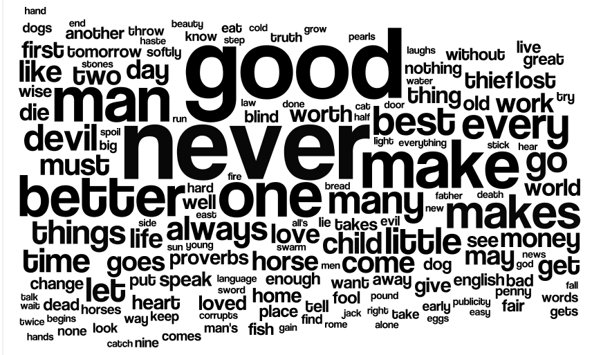
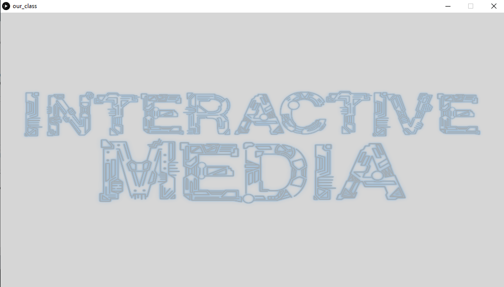
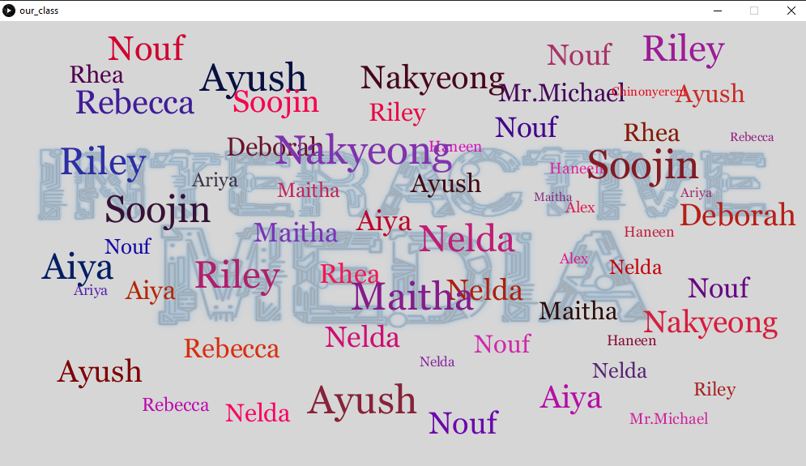
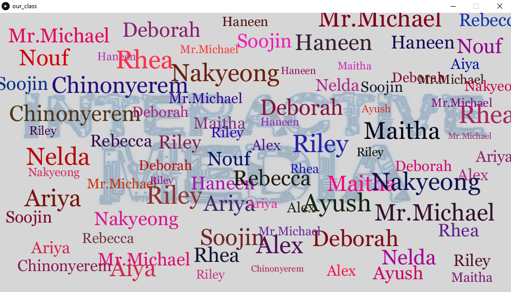
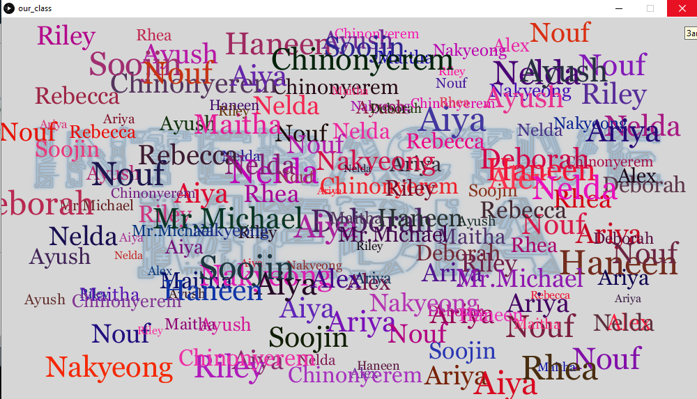

# Assignment 3: generative text or data visualisation

## Description: 
This week's assignment required us to either create a data visulisation or a generative text. I decide to create a generative text. Initially, I was planning to show different popular brands 
in fashion industry but then came up with the idea of generating the names of creative students in this Introduction to Interactive Media class.

## Motivation:
I got inspired by a random word generator because I often used to see this kind of pictures as posters in my high school.
 

## Discovery:
I learned how to 
1. Change the transparency/opacity of backgroung image

tint(255,50);
2. Convert string to Arrays
3. Change the font type, mode and size of texts

println(PFont.list());

## Helpful resources:
https://processing.org/tutorials/typography/

https://www.youtube.com/watch?v=NLzne4XaR3M&t=1s

## Here is the final result:

##Demonstration:

