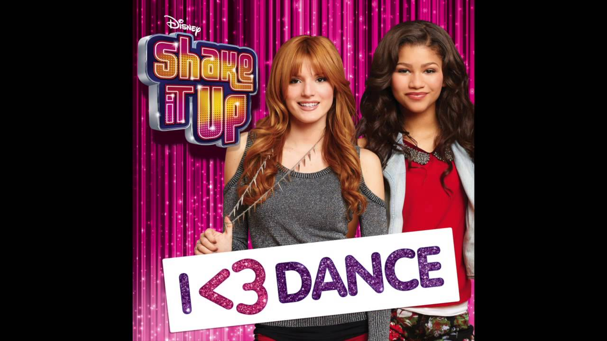
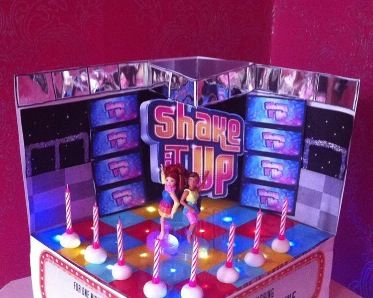
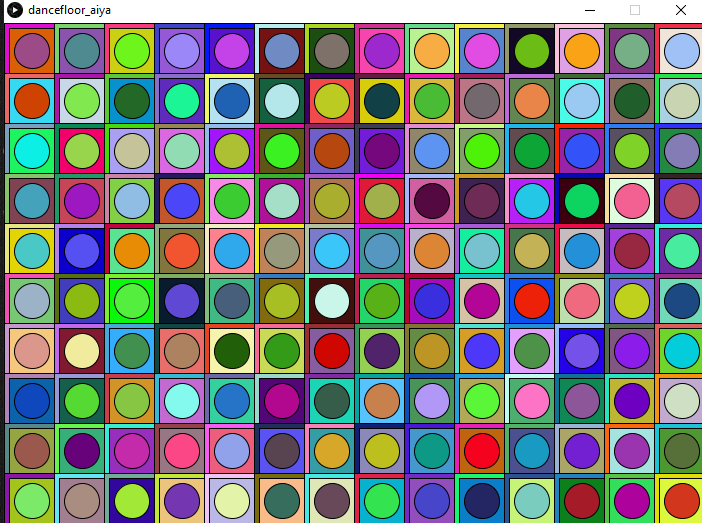
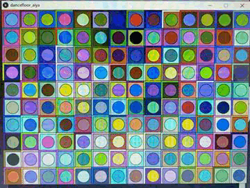

# Assigment 2: Loop Artwork

## Description ##

For this production assignment, we had to create any type of art work using for or while loops. I created an illuminated disco dance floor.

## Difficulties and Motivation ##

The most difficult part was coming up with an unusual idea. At the beginning, I did not know what to create and in what way. However, on Instagram I came across my friend's post, where 
she talks about her favourite childhood TV Series - Shake It Up. 
 
I also used to watch it with my little sister. This American TV Series about 2 best friends, who participate in a local show 
"Shake It Up, Chicago!" to become professional dancers. I recalled how they always used beautiful and colored dance floor to prepare for their contest. So, then I decided to create the 
illuminated disco dance floor.

Also, as I wanted to show different colors every second as LED effect it took some time to figure out the place of random function inside the loop. 

## Screenshot ##

Here is my final result:

Gif version:
 

