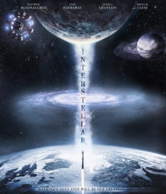

# Assignment 3: game/art using object-oriented programming 

## Description: 
This week's assignment required us to use object-oriented programming, especially classes to either create any work of art or game. I made a simple game, which is 
called "Catching Asteroids". Before creating this game, I watched tutorials for processing and OOP by Daniel Shiffman. It was really helpful to understand the overall concept
behind the OOP. I used arraylist, oblects and created 2 different classes for this assignment: one for asteroids that fall, and the next one for a basket to catch those asteroids.

## Motivation:
Initially, I created a game where a person should move a basket to catch simple goals. But then I got inspired by a movie Interstellar and decided to shape these simple balls 
into asteroids. A person, shoulld catch these asteroids by moving basket.
 

## Difficulties:
The most time-consuming and tricky part while processing this game was to catch the asteroids that are falling from top to bottom and put them inside the basket.
I could not unserstand how to do the like a collision staff between two oblects. Other than that, I did not know hot to increment the score of the game. Because initially, 
when basket catched one asteroid it used to add many scores even though it was only one asteroid.

## Discovery:
I learned how to 
1. Use arraylist, create classes and objects;
2. Add background image and set its size as the canvas';
3. Add a text, set its font, color and fontsize;
4. Increment the score;
5. Use the opacity, and change the bottom two angles of a rectangular.

